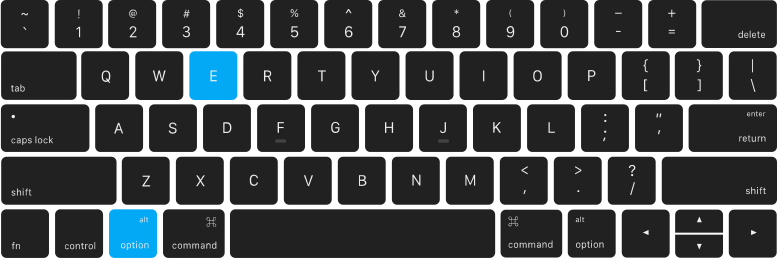
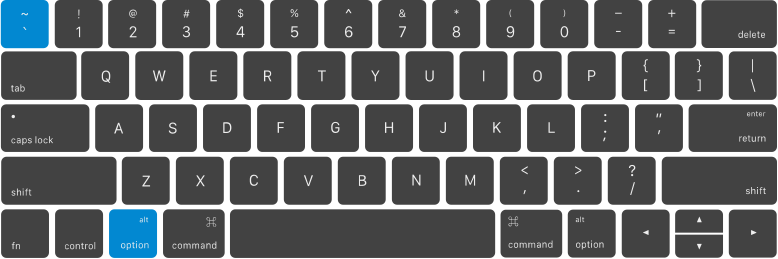
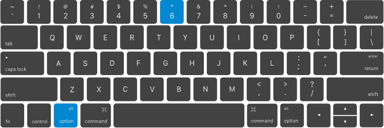
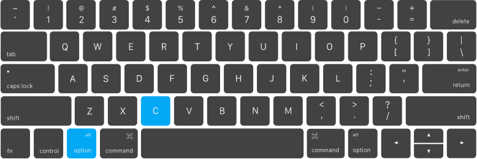
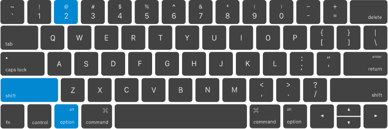
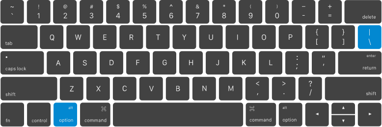
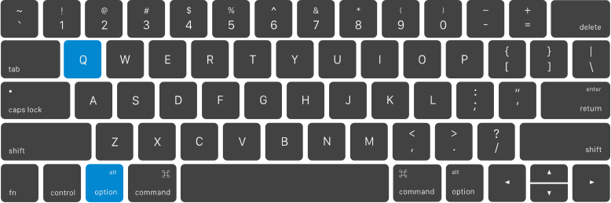
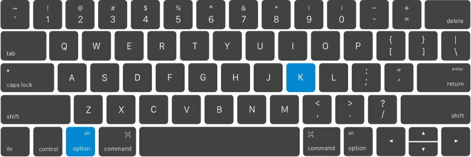
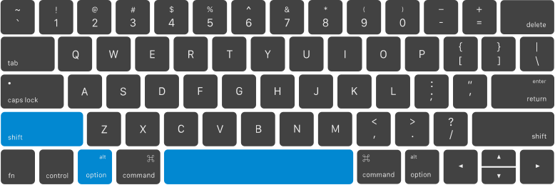

# Special French characters on Qwerty Apple keyboards

- [**Acute accent** (Accent aigu)](#acute-accent)
- [**Grave accent** (Accent grave)](#grave-accent)
- [**Circumflex** (Accent circonflexe)](#circumflex)
- [**Diaeresis** (Tréma)](#diaeresis)
- [**Cedilla** (Cédille)](#cedilla)
- [**Euro sign** (Symbole euro)](#euro-sign)
- [**French quotation marks** (Guillemets français)](#french-quotation-marks)
- [**Ligature of o and e** (E dans l’o)](#ligature-of-o-and-e)
- [**Degree symbol** (Symbole degré)](#degree-symbol)
- [**Non-breaking space** (Espace insécable)](#non-breaking-space)

## Acute accent

**Accent aigu** (*É*, *é*)  
`Option` + `E` followed by the letter to accentuate

  

## Grave accent

**Accent grave** (*À*, *È*, *Ù*, *à*, *è*, *ù*)  
`Option` + `` ` `` followed by the letter to accentuate

  

## Circumflex

**Accent circonflexe** ou "chapeau" (*Â*, *Ê*, *Î*, *Ô*, *Û*, *â*, *ê*, *î*, *ô*, *û*)  
`Option` + `^` followed by the letter to accentuate

  

## Diaeresis

**Tréma** (*Ë*, *Ï*, *Ü*, *ë*, *ï*, *ü*)  
`Option` + `U` followed by the letter to accentuate

  

## Cedilla

**Cédille** (*Ç*, *ç*)  
`Option` + `C` followed by the letter where to place the diacritics

  

## Euro sign

**Symbole euro** (*€*)  
`Option` + `Shift` + `2`

  

## French quotation marks

**Guillemets français** (*«*, *»*)  
`Option` + `\` (For opening French quotation marks)  
`Option` + `Shift` + `\` (For closing French quotation marks)

  

## Ligature of o and e

**E dans l’o** (*Œ*, *œ*)  
`Option` + `Q`  
`Option` + `Shift` + `Q` (For uppercase ligature)

## Degree symbol

**Symbole degré** (*°*)  
`Option` + `K`

  

## Non-breaking space

**Espace insécable** ( )  
`Option` + `Shift` + `Space`

  
